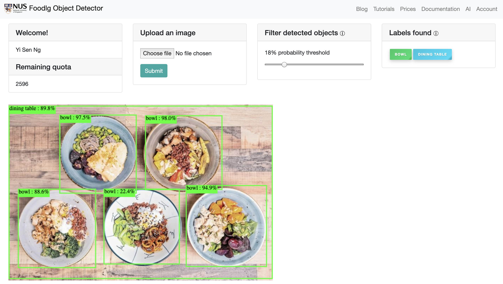

# Foodlg Object Detector Web App



1. User uses Web UI to authenticate with external Okta server 
2. Once authenticated, users can send an image to Model API
3. Model API returns object data and Web UI displays detected objects
4. User interacts with Web UI to view and filter detected objects

## Access the Live Demo

http://ec2-52-77-215-17.ap-southeast-1.compute.amazonaws.com:8090/

## Featured Technologies

* [Node.js](https://nodejs.org/): An open-source JavaScript run-time environment for executing server-side JavaScript code.
* [JQuery](https://jquery.com): jQuery is a cross-platform JavaScript library designed to simplify the client-side scripting of HTML.
* [Express](https://expressjs.com): A popular and minimalistic web framework for creating APIs and Web servers.

## Steps (run locally)

#### Start the Web App

1. [Get a local copy of the repository](#1-get-a-local-copy-of-the-repository)
2. [Install dependencies](#2-install-dependencies)
3. [Start the web app server](#3-start-the-web-app-server)

#### 1. Get a local copy of the repository

Clone the web app repository locally. In a terminal, run the following command:

```
$ git clone https://github.com/vaanforz/Foodlg-Object-Detector-Web-App.git
$ cd Foodlg-Object-Detector-Web-App
```

#### 2. Install dependencies

Make sure Node.js and npm are installed then, in a terminal, run the following command:

```
$ npm install
```

#### 3. Start the web app server

You then start the web app by running:

```
$ nodejs app
```

You can then access the web app at: [`http://localhost:8090`](http://localhost:8090)

